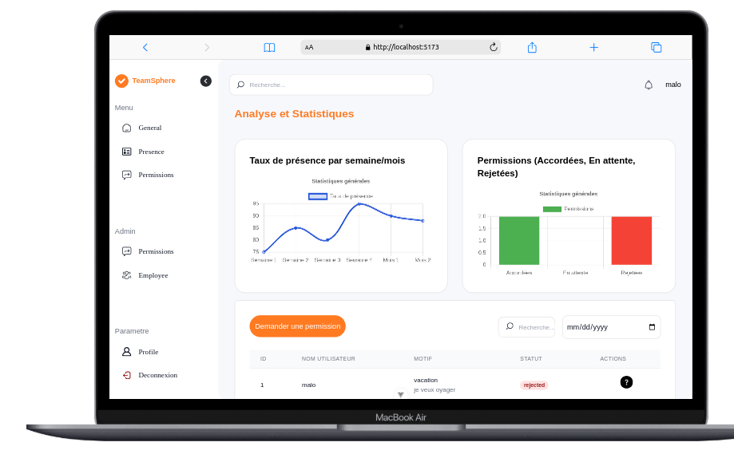
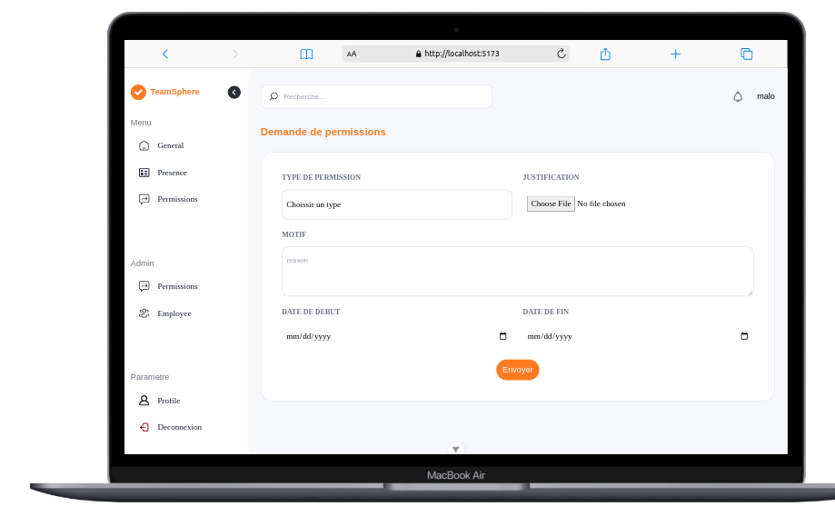
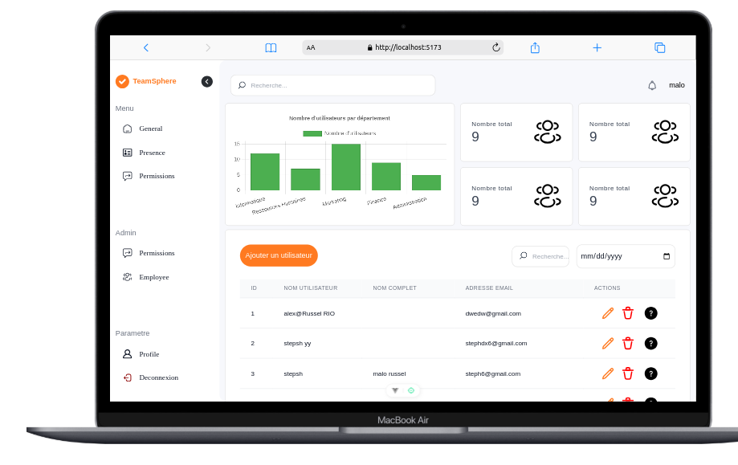
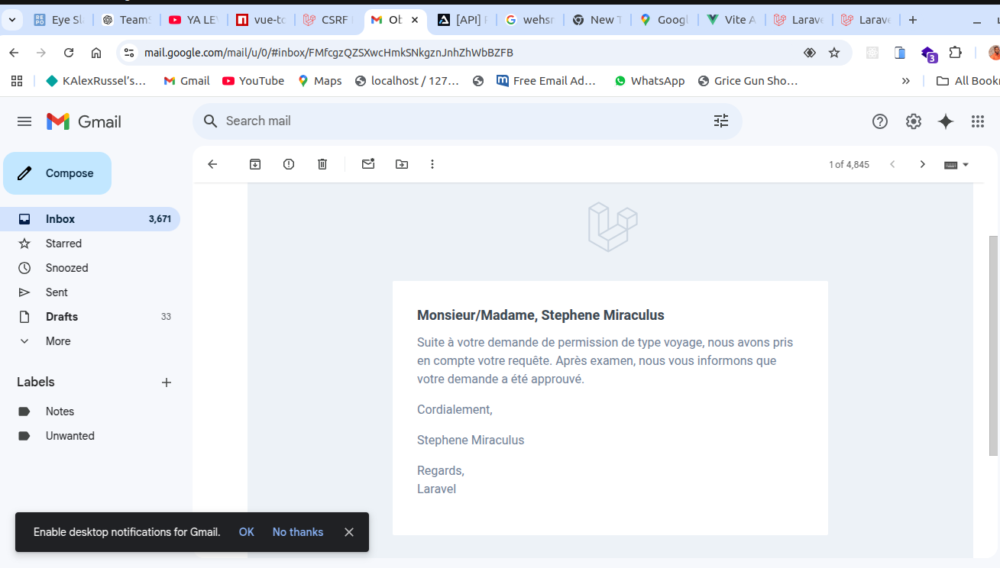
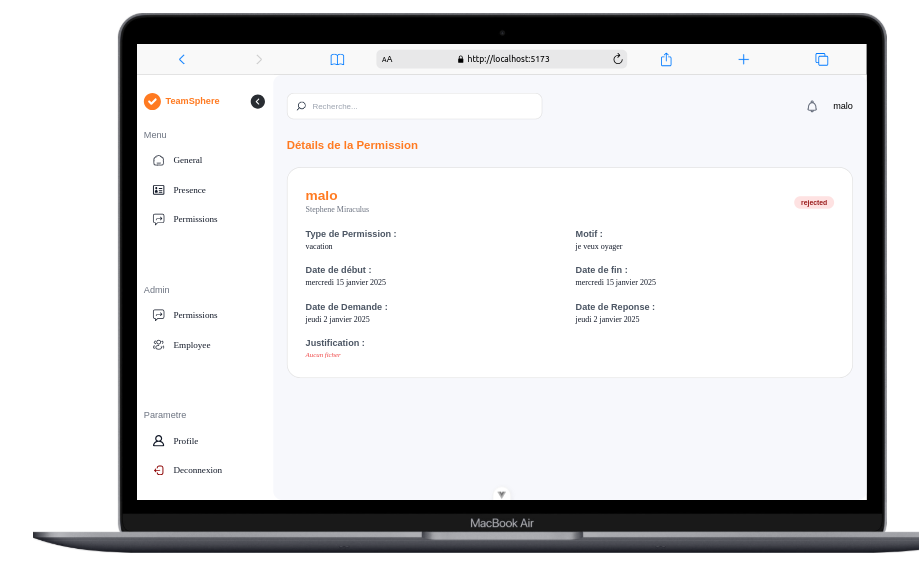
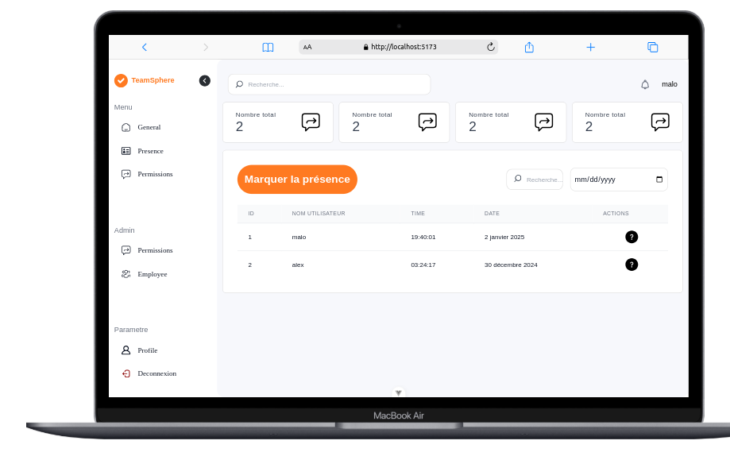

# TeamSphere

🌍 **French**: Système de gestion de présence et de permissions des employés  
🌍 **English**: Employee attendance and permission management system

## Important Note / Note Importante

### English
To set up and use this application, please refer to:
- The README in the `/Teamsphere_frontend` directory for frontend setup instructions
- The README in the `/TeamSphere_backend` directory for backend setup instructions

Each README contains detailed documentation about installation, configuration, and usage of their respective components.

### Français
Pour installer et utiliser cette application, veuillez consulter :
- Le README dans le dossier `/Teamsphere_frontend` pour les instructions d'installation frontend
- Le README dans le dossier `/TeamSphere_backend` pour les instructions d'installation backend

Chaque README contient une documentation détaillée sur l'installation, la configuration et l'utilisation de leurs composants respectifs.

  

  

  

  

  

  

  

